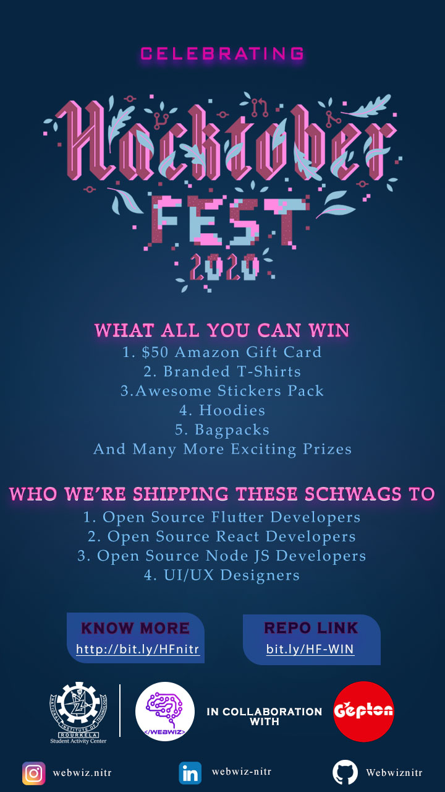

# Project Milky 🥛
<!-- ALL-CONTRIBUTORS-BADGE:START - Do not remove or modify this section -->

<!-- ALL-CONTRIBUTORS-BADGE:END -->

The scope of the project is to design and deploy a Milk Delivery ERP system.
The vision of this project is to develop and deploy an open source project to help out farmers in organising their milk delivery network.

### We are really excited to see your awesome PRs. As a recognition of your awesome efforts, we would be Shipping Free Schwag Kits 🎁 as a contribution gratitute.

`Contributions for Hacktoberfest 2020 are welcome 🎉🎉`

### SCHAWAG KIT INCLUDES:
- $50 Amazon Gift Card for the Best Contributor💵
- Branded T-Shirts👕
- Hoodies😋
- Bagpacks🎒
- Stickers Pack😍
- And Many More Exciting Prizes🎁

Please refer to the project's style and contribution guidelines for submitting patches and additions. In general, we follow the "fork-and-pull" Git workflow.

 1. **Fork** the repo on GitHub
 2. **Clone** the project to your own machine
 3. **Commit** changes to your own branch
 4. **Push** your work back up to your fork
 5. Submit a **Pull request** so that we can review your changes

NOTE 1: Please abide by the [Contributing Guidelines](https://github.com/Webwiznitr/MilkERP/blob/master/CONTRIBUTING.md).

NOTE 2: Please abide by the [Code of Conduct](https://github.com/Webwiznitr/MilkERP/blob/master/CODE_OF_CONDUCT.md).

 

# Project is divided into 3 main parts.
- Delivery Executive App
- Customer App
- Admin Panel

## Delivery Executive App (Flutter Project)
- Flutter Based Modern UI for login page.
- Flutter Based Modern UI for Main page.

## Customer App (Flutter Project)
- Flutter Based Modern UI for login page.
- Flutter Based Modern UI for Main page.

## Admin Panel (A Web Based Platform based on Node, React & Bootstrap4)
- React or Bootstrap Based Responsive Admin Panel Layout

More Details are coming soon...

## Contributors ✨

Thanks goes to these wonderful people ([emoji key](https://allcontributors.org/docs/en/emoji-key)):

<!-- ALL-CONTRIBUTORS-LIST:START - Do not remove or modify this section -->
<!-- prettier-ignore-start -->
<!-- markdownlint-disable -->
<table>
  <tr>
    <td align="center"><a href="https://abhibhaw.team"> <b>Abhibhaw Asthana</b></a> <a href="https://github.com/Webwiznitr/MilkERP/commits?author=abhibhaw" title="Documentation">📖</a></td>
  </tr>
</table>

<!-- markdownlint-enable -->
<!-- prettier-ignore-end -->
<!-- ALL-CONTRIBUTORS-LIST:END -->

This project follows the [all-contributors](https://github.com/all-contributors/all-contributors) specification. Contributions of any kind welcome!